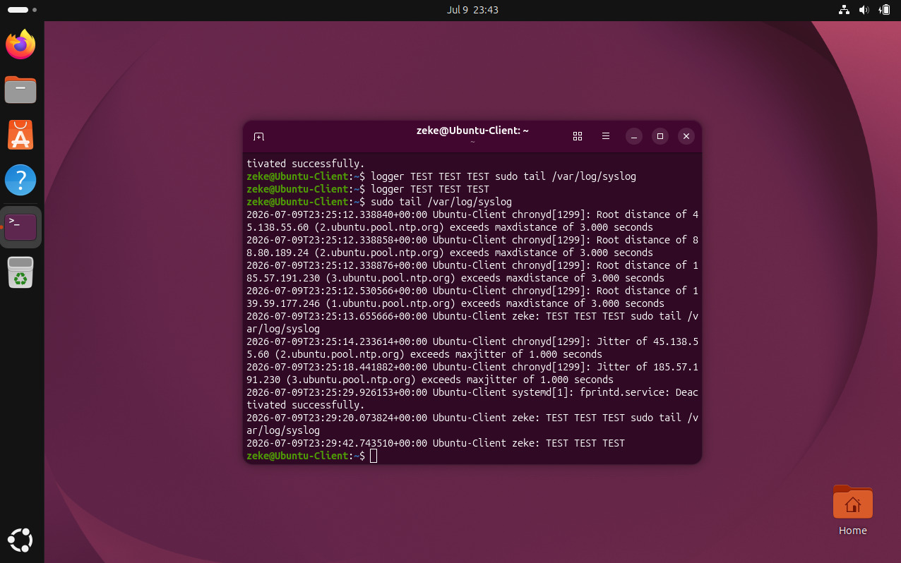
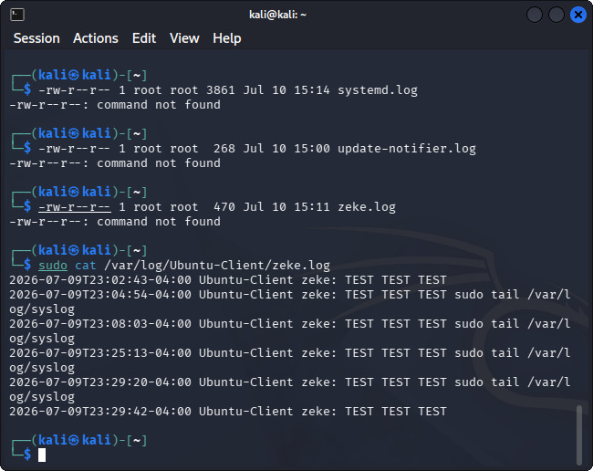

# SIEM Log Forwarding & Centralized Logging

## Objective

Set up centralized log collection between two machines to simulate a basic SIEM (Security Information and Event Management) ingestion pipeline — the kind of setup a SOC analyst relies on to monitor multiple systems from a single point rather than checking logs on each machine individually.

## Environment

- **Kali Linux VM** — configured as the rsyslog server (log collector), IP: 192.168.0.238
- **Ubuntu VM** — configured as the client (log source), IP: 192.168.0.162
- Both machines connected via bridged networking in VirtualBox

## Process

1. Configured `rsyslog` on the Kali VM to listen for incoming log messages on the standard syslog port, allowing it to act as a centralized log collector.
2. Configured the Ubuntu client to forward its system logs to the Kali server's IP address, so that all log events generated on Ubuntu would be sent and stored centrally.
3. While working through the setup documentation, I identified two errors in the provided coursework material:
   - The config used `%PROGRAMME%` instead of the correct rsyslog template variable `%PROGRAMNAME%`
   - A missing `$` prefix on a config directive that rsyslog requires to parse the line correctly
   
   I corrected both in my own configuration and flagged them to my course tutor for review.
4. Restarted the rsyslog service on both machines and generated test log events on the Ubuntu client to confirm they were being received and stored on the Kali server.

## Why this matters for SOC work

Centralized logging is the foundation of any SOC's visibility into an environment — you can't detect or investigate what you can't see. This exercise gave me hands-on experience with:
- How log forwarding actually works at the configuration level (not just "logs magically appear in a dashboard")
- Reading and troubleshooting rsyslog configuration syntax
- Verifying that a logging pipeline is functioning correctly end-to-end — a step that's easy to skip but critical, since a silently broken log pipeline creates blind spots

## Key findings

- Successfully forwarded and verified log events from the Ubuntu client to the centralized Kali rsyslog server
- Identified and corrected two configuration errors in the source documentation that would have prevented log forwarding from working as described

## Screenshots

 

   

## What I learned

Configuration-level troubleshooting is a big part of making any logging or SIEM pipeline actually work — small syntax issues (a missing `$`, a mistyped variable name) can silently break log forwarding without throwing an obvious error. Catching and correcting these gave me a much better appreciation for why log pipeline health checks are a standard part of SOC operational hygiene.
